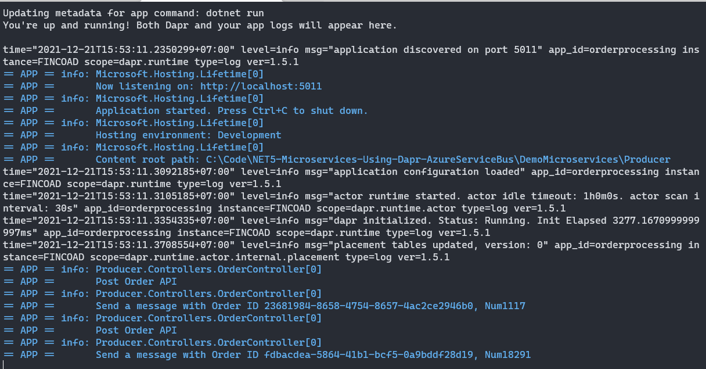
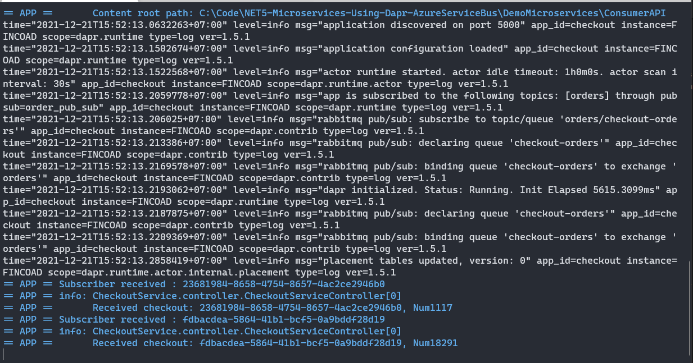
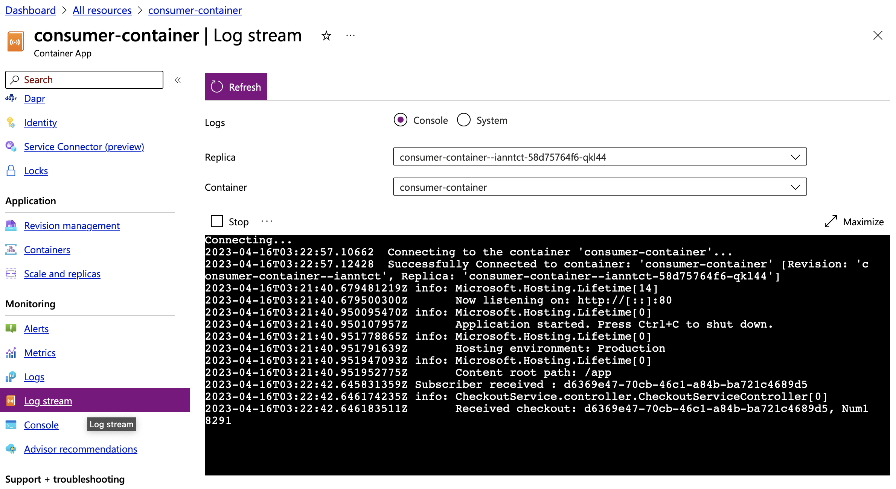
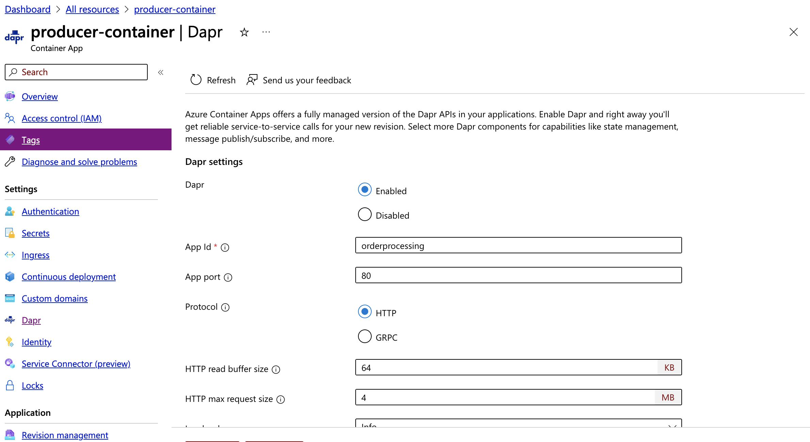
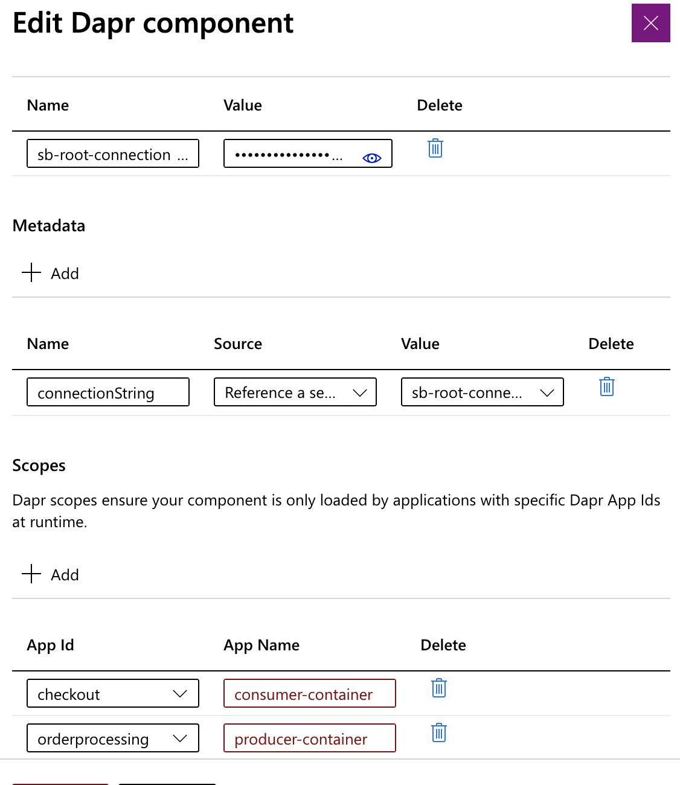
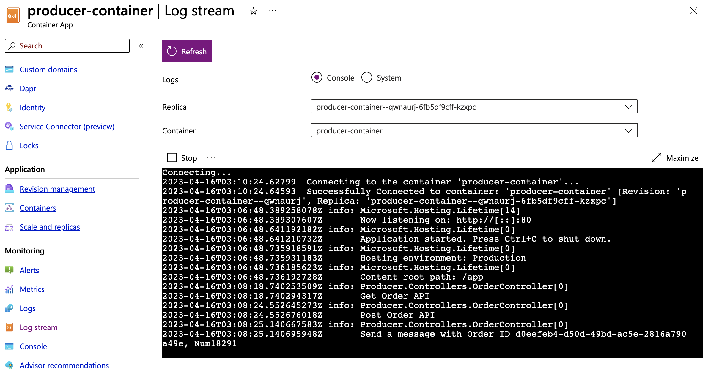

# DAPR: publish and subscribe messages example
Example: Distributed Application Runtime(DAPR) Publish and Subscriber messages
    - Using .NET7
    - Using RabbitMQ on local
    - Using AzureServiceBus

### Requirements
----------------
+ Install [Dapr](https://docs.dapr.io/getting-started/)
+ Install .NET7

### Structures
----------------
+ Producer: using the API sends messages
+ Consumer: receive messages from pubSubName and Topic
+ Messages: create message model
+ Components: `pubsub.yaml` is config your message bus (RabbitMQ)


### Usages
+ Start RabbitMQ:
    ```
    cd DemoMicroservices
    docker-compose up
    ```
+ Using RabbitMQ:
    Set PubSubName="order-pub-sub"

+ Start Consumer(app-id: checkout)
    ```
    cd DemoMicroservices\Consumer
    dapr run --app-id checkout --components-path ../../ComponentsLocal --app-port 5000 --dapr-http-port 3500 --dapr-grpc-port 60002 dotnet run
    ```
    The /checkout endpoint matches the route defined in the subscriptions and this is where Dapr will send all topic messages to.
    It will be created a queue with name: checkout-orders

+ Start Producer(app-id: orderprocessing)
    ```
    cd DemoMicroservices\Producer
    dapr run --app-id orderprocessing --app-port 5011 --dapr-http-port 3501 --dapr-grpc-port 60001 --components-path ../../ComponentsLocal dotnet run
    ```

+ Send a message from Producer to Consumer
    ```
    http://localhost:5011/order
    {
        "OrderAmount":12.7,
        "OrderNumber":"Num18291",
        "OrderDate":"2021-12-21"
    }
    ```

### Using Azure Container App and Azure Service Bus
+ Create Azure Credential
    ```
    az ad sp create-for-rbac --name "myApp" --role contributor \
        --scopes /subscriptions/{subscription-id}/resourceGroups/{resource-group} \
        --sdk-auth
    ```

+ Create Dapr Component
    $ENVIRONMENT: Container App Environment

    ```
    az containerapp env dapr-component set \
        --name $ENVIRONMENT --resource-group $RESOURCE_GROUP \
        --dapr-component-name order-pub-sub \
        --yaml '.\Components\pubsub.yaml'
    ```

+ Enable Ingress in Producer Container
    ```
    az containerapp ingress enable --name producer-container  \
        --resource-group containers --target-port 80 --exposed-port 80 \
        --transport http --type external --allow-insecure
    ```

### Result
+ Publish message
    


+ Consumer message
    


+ Consumer Container Config in Azure
    

+ Producer Container Config in Azure
    

+ Add Dapr Component in Azure
    

+ Producer Logging in Azure
    

### References
--------------
+ [Dapr Pub Sub ASP Net Core integration](https://yourazurecoach.com/2019/12/27/exploring-dapr-pub-sub-part-2-asp-net-core-integration/)
+ [Dapr publish subcriber for net developers](https://docs.microsoft.com/en-us/dotnet/architecture/dapr-for-net-developers/publish-subscribe)
+ [Publish a message and subscribe to a topic](https://docs.dapr.io/developing-applications/building-blocks/pubsub/howto-publish-subscribe/)
